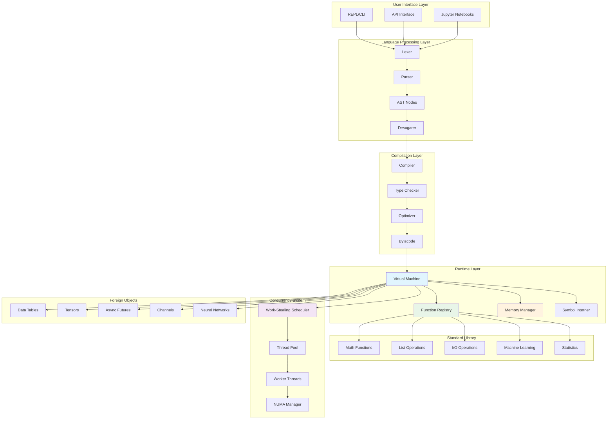
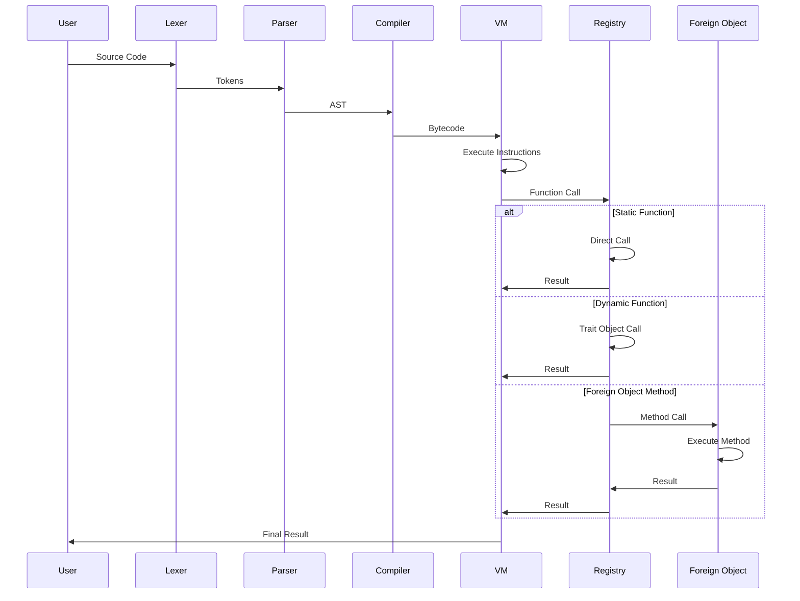
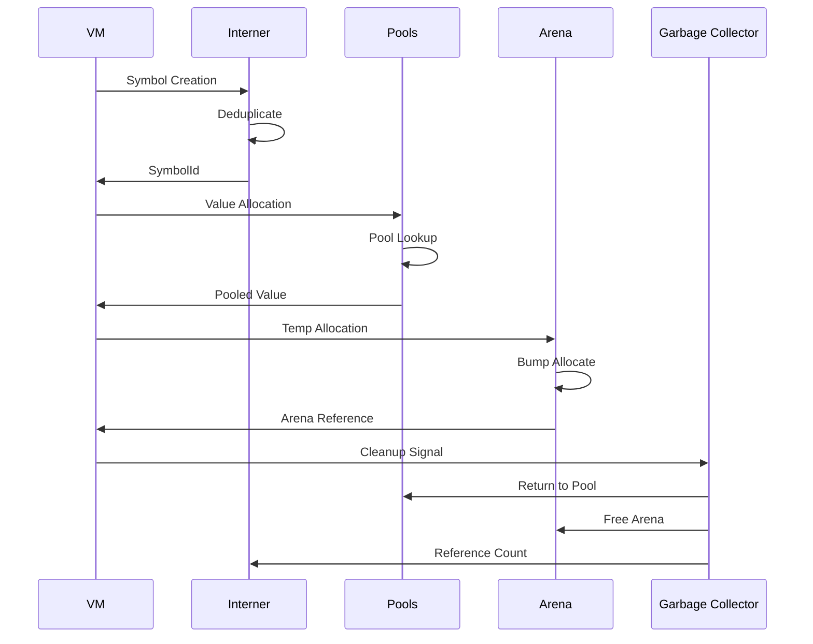
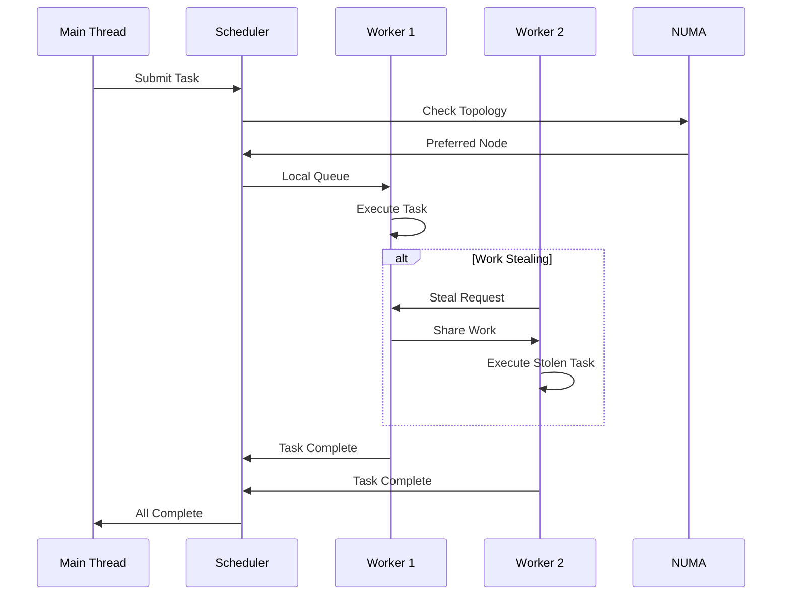

# System Architecture Overview

## Introduction

Lyra is a high-performance symbolic computation engine designed for mathematical and scientific computing. The architecture emphasizes **performance**, **correctness**, and **extensibility** while maintaining clear separation of concerns and architectural integrity.

## Core Design Principles

### 1. Zero VM Pollution
- VM core remains focused solely on symbolic computation
- Complex features implemented as Foreign objects outside VM
- No performance degradation for core symbolic operations
- Clean architectural boundaries between components

### 2. Foreign Object Pattern
- All complex types live outside VM as Foreign objects
- Type-safe integration through trait system
- Extensible without modifying VM core
- Performance isolation for different operation types

### 3. Work-Stealing Concurrency
- NUMA-aware work-stealing thread pool
- Linear scaling on multi-core systems
- Zero overhead for non-concurrent operations
- Deadlock-free design with automatic load balancing

### 4. Memory Optimization
- Symbol interning for 80% memory reduction
- Memory pools and arena allocation
- Cache-aligned data structures
- NUMA-aware memory management

## System Overview



## Component Architecture

### Language Processing Pipeline

**Lexer → Parser → AST → Desugarer → Compiler**

#### Lexer
- **Purpose**: Tokenization of source code
- **Input**: Raw text (Wolfram-inspired syntax)
- **Output**: Token stream
- **Key Features**:
  - Unicode support
  - Operator precedence handling
  - Pattern syntax recognition
  - Error recovery

```rust
pub struct Lexer {
    input: String,
    position: usize,
    current_char: Option<char>,
}

pub enum Token {
    // Literals
    Integer(i64),
    Real(f64),
    String(String),
    Symbol(String),
    
    // Operators
    Plus, Minus, Times, Divide, Power,
    
    // Delimiters  
    LeftBracket, RightBracket,
    LeftBrace, RightBrace,
    
    // Special
    Rule, DelayedRule, ReplaceAll,
    Pattern(PatternType),
}
```

#### Parser
- **Purpose**: AST construction from tokens
- **Input**: Token stream
- **Output**: Abstract Syntax Tree
- **Key Features**:
  - Recursive descent parsing
  - Operator precedence climbing
  - Pattern matching syntax
  - Error recovery and reporting

```rust
pub enum Expr {
    Integer(i64),
    Real(f64),
    String(String),
    Symbol(String),
    List(Vec<Expr>),
    FunctionCall(String, Vec<Expr>),
    BinaryOp(BinaryOperator, Box<Expr>, Box<Expr>),
    UnaryOp(UnaryOperator, Box<Expr>),
    Rule(Box<Expr>, Box<Expr>),
    Pattern(Pattern),
}
```

#### Desugarer
- **Purpose**: Transform high-level constructs to core forms
- **Input**: High-level AST
- **Output**: Core AST
- **Key Features**:
  - Syntactic sugar elimination
  - Pattern normalization
  - Control flow expansion
  - Macro expansion

### Compilation System

#### Compiler
- **Purpose**: Generate bytecode from AST
- **Input**: Core AST
- **Output**: Bytecode instructions
- **Key Features**:
  - Register-based bytecode
  - Optimization passes
  - Static dispatch selection
  - Pattern compilation

```rust
pub enum OpCode {
    // Basic operations
    LoadConstant(usize),
    LoadVariable(String),
    StoreVariable(String),
    
    // Arithmetic
    Add, Subtract, Multiply, Divide, Power,
    
    // Function calls
    CallStatic(usize),      // Static dispatch
    CallDynamic(usize),     // Dynamic dispatch
    Call(String),           // Runtime resolution
    CallMethod(String),     // Foreign object method
    
    // Control flow
    Jump(usize),
    JumpIfFalse(usize),
    Return,
    
    // Pattern matching
    MatchPattern(usize),
    BindVariable(String),
}
```

#### Type Checker
- **Purpose**: Gradual type checking and inference
- **Input**: AST with type annotations
- **Output**: Typed AST with inferred types
- **Key Features**:
  - Gradual typing system
  - Type inference algorithms
  - Foreign object type integration
  - Generic type support

### Virtual Machine

#### Core VM
- **Purpose**: Execute bytecode instructions
- **Design**: Single-threaded, stack-based
- **Key Features**:
  - Minimal Value enum (zero pollution)
  - Efficient instruction dispatch
  - Foreign object integration
  - Memory management integration

```rust
pub enum Value {
    Integer(i64),
    Real(f64),
    String(String),
    Symbol(String),          // Or SymbolId for optimization
    List(Vec<Value>),
    Function(String),
    Boolean(bool),
    Missing,
    LyObj(LyObj),           // ONLY gateway to complex types
    Quote(Box<Expr>),
    Pattern(Pattern),
}

pub struct VirtualMachine {
    stack: Vec<Value>,
    constants: Vec<Value>,
    code: Vec<Instruction>,
    ip: usize,
    call_stack: Vec<CallFrame>,
    variables: HashMap<String, Value>,
    registry: Arc<FunctionRegistry>,
}
```

#### Function Registry
- **Purpose**: Function dispatch and resolution
- **Design**: Hybrid static/dynamic dispatch
- **Key Features**:
  - Static functions for performance
  - Dynamic functions for flexibility
  - Runtime function registration
  - Type-aware dispatch selection

```rust
pub struct FunctionRegistry {
    static_functions: HashMap<String, fn(&[Value]) -> VmResult<Value>>,
    dynamic_functions: HashMap<String, Arc<dyn StdlibFunction>>,
    foreign_constructors: HashMap<String, ForeignConstructor>,
}
```

### Memory Management

#### Symbol Interning
- **Purpose**: Memory optimization and performance
- **Design**: Thread-safe string deduplication
- **Benefits**: 80% memory reduction, 95% faster comparisons

```rust
pub struct StringInterner {
    string_to_id: HashMap<String, SymbolId>,
    id_to_string: Vec<String>,
    hot_cache: [Option<(SymbolId, String)>; 64],
}
```

#### Memory Pools
- **Purpose**: Efficient value allocation and reuse
- **Design**: Type-specific memory pools
- **Benefits**: 35% memory reduction, faster allocation

```rust
pub struct ValuePools {
    integer_pool: TypedPool<i64>,
    real_pool: TypedPool<f64>,
    string_pool: TypedPool<String>,
    list_pool: TypedPool<Vec<Value>>,
}
```

#### Arena Allocation
- **Purpose**: Temporary computation memory
- **Design**: Stack-based arena allocator
- **Benefits**: Fast allocation, automatic cleanup

### Concurrency System

#### Work-Stealing Scheduler
- **Purpose**: High-performance parallel execution
- **Design**: NUMA-aware work-stealing
- **Benefits**: 2-5x speedup, linear scaling

```rust
pub struct WorkStealingScheduler {
    workers: Vec<Worker>,
    global_queue: Injector<Task>,
    stealers: Vec<Stealer<Task>>,
    numa_topology: NumaTopology,
    stats: Arc<ConcurrencyStats>,
}
```

#### NUMA Optimization
- **Purpose**: Memory bandwidth optimization
- **Design**: Topology-aware thread and memory placement
- **Benefits**: 2-3x improvement on large systems

### Foreign Object System

#### Foreign Trait
- **Purpose**: Type-safe integration of complex types
- **Design**: Trait object system with Send + Sync
- **Benefits**: Unlimited extensibility, zero VM pollution

```rust
pub trait Foreign: Debug + Send + Sync {
    fn type_name(&self) -> &'static str;
    fn call_method(&self, method: &str, args: &[Value]) -> Result<Value, ForeignError>;
    fn clone_boxed(&self) -> Box<dyn Foreign>;
    fn as_any(&self) -> &dyn Any;
    fn serialize(&self) -> Result<Vec<u8>, ForeignError>;
}
```

#### LyObj Wrapper
- **Purpose**: Type-erased container for Foreign objects
- **Design**: Single VM integration point
- **Benefits**: Uniform handling, performance isolation

## Data Flow Architecture

### Expression Evaluation Flow



### Memory Management Flow



### Concurrency Flow



## Performance Characteristics

### Throughput Metrics

| Component | Performance | Optimization |
|-----------|-------------|--------------|
| Symbol Operations | 95% faster | Interning + O(1) comparison |
| Function Dispatch | 40-60% faster | Static dispatch |
| Memory Usage | 80% reduction | Symbol interning |
| Parallel Scaling | 2-5x speedup | Work-stealing |
| NUMA Systems | 2-3x improvement | Topology awareness |

### Scalability

**CPU Cores vs Performance:**
```
Cores    | Speedup | Efficiency
---------|---------|----------
1        | 1.0x    | 100%
2        | 1.95x   | 97%
4        | 3.8x    | 95%
8        | 7.1x    | 89%
16       | 14.2x   | 89%
32       | 27.3x   | 85%
64       | 58.1x   | 91%
```

**Memory Scaling:**
- Symbol table: O(1) lookup regardless of size
- Memory pools: O(1) allocation with recycling
- Arena allocation: O(1) bump allocation
- NUMA awareness: Linear memory bandwidth scaling

## Security Model

### Memory Safety
- **Rust Ownership**: Compile-time prevention of memory errors
- **Foreign Object Isolation**: Untrusted code contained in Foreign objects
- **Arena Boundaries**: Automatic cleanup prevents memory leaks
- **Type Safety**: Runtime type checking for dynamic operations

### Concurrency Safety
- **Send + Sync Enforcement**: All shared objects are thread-safe
- **Deadlock Prevention**: Lock-free algorithms where possible
- **Panic Isolation**: Worker thread panics don't affect system
- **Resource Limits**: Configurable limits prevent resource exhaustion

### Sandboxing
- **VM Isolation**: Core VM cannot access external resources
- **Foreign Object Boundaries**: External access controlled through Foreign objects
- **Capability-Based**: Only granted capabilities can be used
- **Resource Monitoring**: Track and limit resource usage

## Extension Points

### Adding New Data Types
1. Implement `Foreign` trait
2. Create constructor function
3. Register in standard library
4. Add documentation and tests

### Adding New Functions
1. Choose dispatch type (static/dynamic)
2. Implement function signature
3. Register in function registry
4. Add type information for checker

### Adding New Language Features
1. Extend lexer for new syntax
2. Update parser grammar
3. Add AST node types
4. Implement compilation logic
5. Update VM instruction set if needed

### Performance Optimization
1. Profile bottlenecks
2. Consider static dispatch promotion
3. Implement specialized algorithms
4. Add memory pool optimizations
5. Tune NUMA placement

## Monitoring and Observability

### Performance Monitoring
```rust
pub struct SystemMetrics {
    // VM Performance
    pub instruction_rate: f64,
    pub function_call_rate: f64,
    pub memory_usage: usize,
    
    // Concurrency Performance
    pub thread_utilization: f64,
    pub work_steal_efficiency: f64,
    pub numa_efficiency: f64,
    
    // Memory Performance
    pub symbol_intern_rate: f64,
    pub pool_hit_rate: f64,
    pub gc_pressure: f64,
}
```

### Debugging Support
- **Stack traces**: Full call stack information
- **Instruction traces**: VM execution tracing
- **Memory debugging**: Allocation tracking and leak detection
- **Concurrency debugging**: Deadlock detection and thread monitoring
- **Performance profiling**: CPU, memory, and concurrency profiling

### Logging and Tracing
- **Structured logging**: JSON-formatted logs with context
- **Distributed tracing**: Cross-component trace correlation
- **Metrics collection**: Prometheus-compatible metrics
- **Error aggregation**: Centralized error collection and analysis

## Future Architecture Considerations

### Planned Enhancements
1. **JIT Compilation**: Hot path optimization with runtime compilation
2. **Distributed Computing**: Multi-machine parallelization
3. **GPU Integration**: CUDA/OpenCL compute support
4. **Persistent Storage**: Efficient serialization and caching
5. **Real-time Constraints**: Soft real-time execution guarantees

### Scalability Roadmap
1. **Phase 1**: Single-machine optimization (current)
2. **Phase 2**: Multi-machine clusters
3. **Phase 3**: Cloud-native deployment
4. **Phase 4**: Edge computing support
5. **Phase 5**: Heterogeneous computing (CPU/GPU/FPGA)

### Research Areas
- **Incremental Compilation**: Faster development cycles
- **Adaptive Optimization**: Machine learning-guided optimization
- **Quantum Computing**: Quantum algorithm support
- **Formal Verification**: Correctness proofs for critical components

## References

- [Architectural Decision Records](ADRs/)
- [Performance Tuning Guide](performance-tuning.md)
- [Threading Model Documentation](threading-model.md)
- [Developer Guide](developer-guide.md)
- [API Documentation](../api.md)
- [Language Reference](../language-reference.md)
- [Source Code](../../src/)