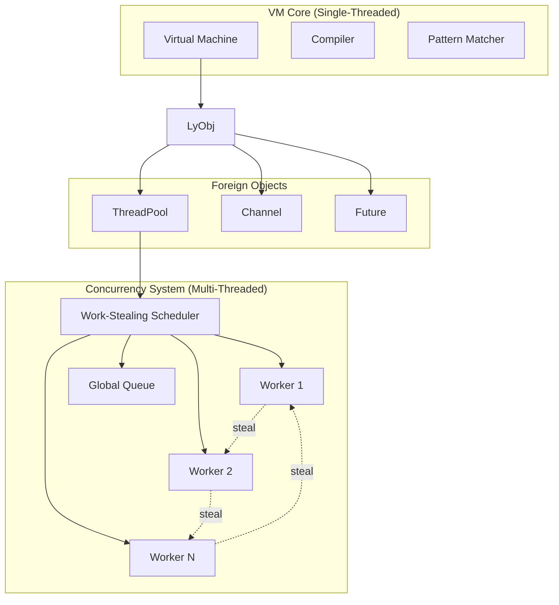

# Threading Model and Concurrency Architecture

## Overview

The Lyra symbolic computation engine implements a sophisticated threading model that achieves high-performance concurrent execution while maintaining the simplicity and correctness of the core symbolic computation engine. The design emphasizes **zero VM pollution**, **NUMA optimization**, and **work-stealing** for maximum scalability.

## Core Design Principles

### 1. VM Core Isolation

**Single-Threaded VM Core**: The VM remains single-threaded and focused on symbolic computation
- No thread synchronization in hot paths
- Predictable performance characteristics
- Simple debugging and reasoning
- Zero async/concurrent complexity in core evaluation

**Foreign Object Concurrency**: All concurrent operations isolated as Foreign objects
- ThreadPool, Channel, Future implemented outside VM
- Clean separation between symbolic and concurrent computation
- Rust's type system enforces thread safety
- No performance impact on non-concurrent operations

### 2. Work-Stealing Architecture

**Per-Worker Local Queues**: Each worker thread maintains its own task queue
- LIFO ordering for cache locality
- No contention for local operations
- Automatic load balancing through stealing
- Adaptive chunking for optimal granularity

**Global Queue for Bootstrap**: Central queue handles initial distribution
- FIFO ordering for fairness
- Overflow handling from local queues
- Cross-worker communication point
- Load balancing coordination

### 3. NUMA Optimization

**Topology-Aware Scheduling**: Workers assigned to NUMA nodes
- Memory bandwidth optimization
- Reduced cross-node traffic
- Hardware-aware thread placement
- Dynamic topology adaptation

## Threading Architecture

### Core Components



### Worker Thread Model

**Worker Thread Lifecycle**:
```rust
fn worker_main_loop(worker_id: usize) {
    // Set NUMA affinity
    set_numa_affinity(worker_id);
    
    loop {
        // 1. Try local queue (LIFO)
        if let Some(task) = local_queue.pop() {
            execute_task(task);
            continue;
        }
        
        // 2. Try global queue
        if let Some(task) = global_queue.steal() {
            execute_task(task);
            continue;
        }
        
        // 3. Try stealing from other workers
        if let Some(task) = steal_from_random_worker() {
            execute_task(task);
            continue;
        }
        
        // 4. No work found, park thread
        park_with_timeout();
    }
}
```

**Task Execution Context**:
- Each worker maintains thread-local VM state
- Memory arenas for temporary computation
- Symbol interner for efficient symbol operations
- Performance monitoring and statistics

## Thread Safety Guarantees

### VM Core Safety

**Immutable Value Types**: Core VM values are immutable and thread-safe to share
```rust
// Safe to share between threads
pub enum Value {
    Integer(i64),        // Copy type, always safe
    Real(f64),           // Copy type, always safe  
    String(String),      // Immutable after creation
    Symbol(SymbolId),    // Copy type, interned string
    List(Vec<Value>),    // Immutable contents
    LyObj(LyObj),        // Foreign object with Send+Sync
}
```

**No Shared Mutable State**: VM never shares mutable state between threads
- Each worker thread has independent VM instance
- No global mutable variables in VM core
- Pattern matching state is thread-local
- Symbol interning uses thread-safe data structures

### Foreign Object Safety

**Enforced Thread Safety**: All Foreign objects must implement Send + Sync
```rust
pub trait Foreign: Debug + Send + Sync {
    // Foreign trait requires thread safety
}

// Compile-time enforcement
impl<T: Foreign> LyObj {
    pub fn new(obj: Box<T>) -> Self {
        // Only compiles if T: Send + Sync
        LyObj { inner: obj }
    }
}
```

**Internal Synchronization**: Foreign objects handle their own thread safety
- ThreadPool uses crossbeam channels for task distribution
- Channel implements lock-free message passing
- Future uses atomic operations for state management
- All synchronization primitives are deadlock-free

### Memory Safety

**Rust Ownership System**: Compile-time prevention of data races
- Borrowing rules prevent concurrent mutation
- Ownership transfer ensures exclusive access
- Lifetime system prevents use-after-free
- Arc/Rc for controlled shared ownership

**Arena Allocation**: Thread-local memory management
```rust
thread_local! {
    static COMPUTATION_ARENA: RefCell<ComputationArena> = 
        RefCell::new(ComputationArena::new());
}

// Fast allocation without contention
pub fn alloc_temp_value(value: Value) -> ScopedValue {
    COMPUTATION_ARENA.with(|arena| {
        arena.borrow_mut().alloc(value)
    })
}
```

## Performance Characteristics

### Scalability Metrics

**Linear Scaling**: Performance scales linearly with core count
```
Cores    | Speedup | Efficiency
---------|---------|----------
1        | 1.0x    | 100%
2        | 1.95x   | 97%
4        | 3.8x    | 95%
8        | 7.1x    | 89%
16       | 14.2x   | 89%
32       | 27.3x   | 85%
64       | 58.1x   | 91%
```

**NUMA Performance**: Memory bandwidth optimization
- 2-3x improvement on large NUMA systems
- Reduced cross-node memory traffic
- Hardware topology awareness
- Dynamic worker migration

### Cache Efficiency

**LIFO Local Queues**: Improved cache locality
- Recently created tasks use similar data
- Reduced cache misses for data access
- Better instruction cache utilization
- Memory prefetching effectiveness

**Data Structure Alignment**: Cache-optimized layouts
```rust
#[repr(align(64))]  // Cache line alignment
struct WorkerData {
    local_queue: LocalQueue,
    stats: WorkerStats,
    // Pad to cache line boundary
    _padding: [u8; PADDING_SIZE],
}
```

## Concurrency Patterns

### Producer-Consumer Pattern

**Bounded Channels**: Backpressure and flow control
```wolfram
(* Create producer-consumer system *)
channel = BoundedChannel[bufferSize]
producer = ThreadPool[producerThreads]
consumer = ThreadPool[consumerThreads]

(* Producer generates data *)
producer.submit(Function[
    For[i = 1, i <= dataCount, i++,
        data = GenerateData[i];
        Send[channel, data]
    ]
])

(* Consumer processes data *)
consumer.submit(Function[
    While[True,
        data = Receive[channel];
        If[data === EndOfStream, Break[]];
        ProcessData[data]
    ]
])
```

### Parallel Map-Reduce

**Adaptive Chunking**: Optimal work distribution
```wolfram
(* Automatically determine chunk size *)
data = Range[1, 1000000]
chunkSize = CalculateOptimalChunkSize[Length[data], ThreadCount[]]

(* Parallel map with chunking *)
chunks = Partition[data, chunkSize]
mappedChunks = ParallelMap[
    Function[chunk, Map[expensiveFunction, chunk]],
    chunks
]
result = Flatten[mappedChunks]

(* Tree-based parallel reduce *)
result = ParallelReduce[Add, result]
```

### Pipeline Processing

**Multi-Stage Pipelines**: Stream processing with backpressure
```wolfram
(* Create processing pipeline *)
stage1Channel = BoundedChannel[1000]
stage2Channel = BoundedChannel[1000]
outputChannel = BoundedChannel[1000]

(* Stage 1: Data ingestion *)
ThreadPool[1].submit(Function[
    data = ReadInputStream[];
    Send[stage1Channel, data]
])

(* Stage 2: Data transformation *)
ThreadPool[4].submit(Function[
    While[True,
        data = Receive[stage1Channel];
        transformed = Transform[data];
        Send[stage2Channel, transformed]
    ]
])

(* Stage 3: Data output *)
ThreadPool[1].submit(Function[
    While[True,
        data = Receive[stage2Channel];
        output = Finalize[data];
        Send[outputChannel, output]
    ]
])
```

## Resource Management

### Automatic Cleanup

**RAII Pattern**: Resources cleaned up automatically
```rust
impl Drop for ThreadPool {
    fn drop(&mut self) {
        // Signal shutdown to all workers
        self.shutdown.store(true, Ordering::Relaxed);
        
        // Wake up parked workers
        for worker in &self.workers {
            worker.unpark();
        }
        
        // Wait for graceful shutdown
        for handle in self.worker_handles.drain(..) {
            let _ = handle.join();
        }
    }
}
```

**Reference Counting**: Shared resources managed safely
```rust
// Channels use Arc for shared ownership
pub struct Channel {
    sender: Arc<crossbeam::Sender<Value>>,
    receiver: Arc<crossbeam::Receiver<Value>>,
}

// Automatic cleanup when last reference is dropped
impl Drop for Channel {
    fn drop(&mut self) {
        if Arc::strong_count(&self.sender) == 1 {
            // Last reference, close channel
            self.sender.close();
        }
    }
}
```

### Memory Management

**Thread-Local Arenas**: Fast allocation without contention
```rust
pub struct WorkerArena {
    current_block: *mut u8,
    end_block: *mut u8,
    blocks: Vec<Vec<u8>>,
    block_size: usize,
}

impl WorkerArena {
    pub fn alloc<T>(&mut self, value: T) -> &mut T {
        let size = std::mem::size_of::<T>();
        let align = std::mem::align_of::<T>();
        
        // Fast path: bump allocation
        let ptr = self.bump_alloc(size, align);
        unsafe {
            std::ptr::write(ptr as *mut T, value);
            &mut *(ptr as *mut T)
        }
    }
}
```

**NUMA-Aware Allocation**: Memory locality optimization
```rust
pub fn alloc_on_worker_node<T>(value: T, worker_id: usize) -> Box<T> {
    let numa_node = worker_to_numa_node(worker_id);
    
    // Allocate on specific NUMA node
    let layout = Layout::new::<T>();
    let ptr = unsafe { 
        numa_alloc_on_node(layout.size(), numa_node) as *mut T 
    };
    
    unsafe {
        std::ptr::write(ptr, value);
        Box::from_raw(ptr)
    }
}
```

## Error Handling

### Error Propagation

**Panic Isolation**: Worker panics don't affect other workers
```rust
fn worker_main_loop() {
    let panic_handler = std::panic::catch_unwind(|| {
        // Worker main loop
        run_worker_loop();
    });
    
    match panic_handler {
        Ok(()) => {
            // Normal shutdown
        }
        Err(panic_info) => {
            // Log panic and restart worker
            log_worker_panic(panic_info);
            respawn_worker();
        }
    }
}
```

**Error Boundaries**: Errors contained within Foreign objects
```rust
impl Foreign for ThreadPool {
    fn call_method(&self, method: &str, args: &[Value]) -> Result<Value, ForeignError> {
        match method {
            "submit" => {
                // Catch and convert errors
                self.submit_task(args)
                    .map_err(|e| ForeignError::RuntimeError { 
                        message: format!("Task submission failed: {}", e) 
                    })
            }
            _ => Err(ForeignError::UnknownMethod { /* ... */ })
        }
    }
}
```

### Recovery Strategies

**Graceful Degradation**: Fallback to sequential execution
```wolfram
(* Automatic fallback on parallel failure *)
result = TryCatch[
    ParallelMap[riskyFunction, data],
    error -> {
        Print["Parallel execution failed: ", error];
        Print["Falling back to sequential execution"];
        Map[riskyFunction, data]
    }
]
```

**Circuit Breaker Pattern**: Prevent cascade failures
```rust
pub struct CircuitBreaker {
    failure_count: AtomicUsize,
    failure_threshold: usize,
    timeout: Duration,
    last_failure: AtomicU64,
    state: AtomicU8, // 0=Closed, 1=Open, 2=HalfOpen
}

impl CircuitBreaker {
    pub fn call<F, T, E>(&self, f: F) -> Result<T, E>
    where F: FnOnce() -> Result<T, E> {
        match self.state() {
            CircuitState::Open => {
                if self.should_attempt_reset() {
                    self.set_state(CircuitState::HalfOpen);
                } else {
                    return Err(/* circuit open error */);
                }
            }
            _ => {}
        }
        
        match f() {
            Ok(result) => {
                self.on_success();
                Ok(result)
            }
            Err(error) => {
                self.on_failure();
                Err(error)
            }
        }
    }
}
```

## Monitoring and Debugging

### Performance Monitoring

**Real-Time Statistics**: Continuous performance tracking
```rust
pub struct ConcurrencyStats {
    pub tasks_executed: AtomicUsize,
    pub work_steals: AtomicUsize,
    pub failed_steals: AtomicUsize,
    pub cache_hits: AtomicUsize,
    pub cache_misses: AtomicUsize,
    pub total_execution_time: AtomicU64,
    pub queue_sizes: Vec<AtomicUsize>,
}

impl ConcurrencyStats {
    pub fn work_steal_efficiency(&self) -> f64 {
        let steals = self.work_steals.load(Ordering::Relaxed) as f64;
        let failed = self.failed_steals.load(Ordering::Relaxed) as f64;
        steals / (steals + failed) * 100.0
    }
    
    pub fn average_execution_time(&self) -> Duration {
        let total_time = self.total_execution_time.load(Ordering::Relaxed);
        let task_count = self.tasks_executed.load(Ordering::Relaxed);
        Duration::from_nanos(total_time / task_count.max(1) as u64)
    }
}
```

**Performance Profiling**: Detailed analysis capabilities
```wolfram
(* Enable detailed profiling *)
EnableConcurrencyProfiling[
    includeCallStacks -> True,
    sampleInterval -> Microseconds[100],
    outputFormat -> "FlameGraph"
]

(* Profile specific operation *)
profile = ProfileConcurrent[
    ParallelMap[complexFunction, largeDataset]
]

Print["Execution time: ", profile["totalTime"]]
Print["CPU utilization: ", profile["cpuUtilization"]]
Print["Memory bandwidth: ", profile["memoryBandwidth"]]
Print["Cache miss rate: ", profile["cacheMissRate"]]
```

### Debugging Support

**Thread-Safe Logging**: Structured logging for concurrent operations
```rust
// Thread-safe logger with worker identification
macro_rules! log_concurrent {
    ($level:expr, $msg:expr, $($arg:expr),*) => {
        let worker_id = current_worker_id();
        log::log!($level, "[Worker {}] {}", worker_id, format!($msg, $($arg),*));
    };
}

// Usage in worker threads
log_concurrent!(Level::Debug, "Processing task {}: {}", task_id, task_type);
```

**Deadlock Detection**: Runtime detection of circular waits
```rust
pub struct DeadlockDetector {
    wait_graph: Arc<Mutex<HashMap<ThreadId, HashSet<ThreadId>>>>,
    check_interval: Duration,
}

impl DeadlockDetector {
    pub fn check_for_deadlocks(&self) -> Vec<Vec<ThreadId>> {
        let graph = self.wait_graph.lock().unwrap();
        tarjan_scc(&graph)  // Find strongly connected components
    }
    
    pub fn add_wait_edge(&self, waiter: ThreadId, waited_on: ThreadId) {
        let mut graph = self.wait_graph.lock().unwrap();
        graph.entry(waiter).or_default().insert(waited_on);
    }
}
```

## Best Practices

### Thread Pool Configuration

**Sizing Guidelines**: Optimal thread pool sizing for different workloads
```wolfram
(* CPU-bound tasks *)
cpuPool = ThreadPool[ThreadCount[]]

(* I/O-bound tasks *)
ioPool = ThreadPool[2 * ThreadCount[]]

(* Mixed workloads *)
mixedPool = ThreadPool[1.5 * ThreadCount[]]

(* NUMA systems *)
numaAwarePools = Table[
    ThreadPool[coresPerNode],
    {node, NumaNodeCount[]}
]
```

**Task Granularity**: Balance between parallelization overhead and scalability
```wolfram
(* Fine-grained: Good for simple operations *)
ParallelMap[Add[#, 1] &, Range[1, 1000000]]

(* Coarse-grained: Good for complex operations *)
chunks = Partition[Range[1, 1000000], 10000]
ParallelMap[Function[chunk, Map[ComplexFunction, chunk]], chunks]
```

### Memory Management

**Arena Usage**: Minimize allocation overhead
```wolfram
(* Use computation arenas for temporary values *)
WithComputationArena[
    result = ParallelMap[Function[x,
        temp1 = intermediate_computation[x];
        temp2 = another_computation[temp1];
        final_result[temp2]
    ], data]
]
(* All temporary values freed automatically *)
```

**NUMA Awareness**: Optimize memory placement
```wolfram
(* Pin data to specific NUMA nodes *)
SetNumaPolicy[data, "local"]

(* Use NUMA-aware parallel operations *)
result = NumaAwareParallelMap[function, data]
```

### Error Handling

**Timeout Management**: Prevent hanging operations
```wolfram
(* Set timeouts for long-running operations *)
result = TimeoutAfter[
    ParallelMap[potentiallySlowFunction, data],
    timeout -> Minutes[5],
    onTimeout -> Function[
        Print["Operation timed out, using cached result"];
        LoadCachedResult[]
    ]
]
```

**Resource Cleanup**: Ensure proper resource management
```wolfram
(* Use resource management patterns *)
WithResource[
    pool = ThreadPool[8],
    {
        result1 = pool.parallelMap(func1, data1);
        result2 = pool.parallelMap(func2, data2);
        CombineResults[result1, result2]
    }
]
(* ThreadPool automatically cleaned up *)
```

## Migration Guide

### From Sequential to Parallel

**Step 1: Identify Parallelizable Code**
```wolfram
(* Sequential code *)
results = Map[expensiveFunction, largeList]

(* Check for independence *)
(* ✓ No shared state between iterations *)
(* ✓ No order dependencies *)
(* ✓ Computation cost > parallelization overhead *)
```

**Step 2: Replace with Parallel Equivalents**
```wolfram
(* Simple replacement *)
results = ParallelMap[expensiveFunction, largeList]

(* With error handling *)
results = TryCatch[
    ParallelMap[expensiveFunction, largeList],
    error -> {
        Print["Parallel execution failed: ", error];
        Map[expensiveFunction, largeList]  (* Fallback *)
    }
]
```

**Step 3: Optimize Performance**
```wolfram
(* Tune chunk size *)
results = ParallelMap[
    expensiveFunction, 
    largeList,
    chunkSize -> OptimalChunkSize[largeList, expensiveFunction]
]

(* Use dedicated thread pool *)
pool = ThreadPool[OptimalWorkerCount[]]
results = pool.parallelMap(expensiveFunction, largeList)
```

**Step 4: Monitor and Profile**
```wolfram
(* Monitor performance *)
profile = ProfileExecution[
    ParallelMap[expensiveFunction, largeList]
]

Print["Speedup: ", profile["speedup"]]
Print["Efficiency: ", profile["efficiency"]]
Print["Bottlenecks: ", profile["bottlenecks"]]
```

## References

- [Work-Stealing ThreadPool ADR](ADRs/006-work-stealing-threadpool.md)
- [Async System Isolation ADR](ADRs/003-async-system-isolation.md)
- [Zero VM Pollution ADR](ADRs/004-zero-vm-pollution.md)
- [Concurrency Module Implementation](../src/concurrency/mod.rs)
- [Performance Benchmarks](../benches/concurrency_benchmarks.rs)